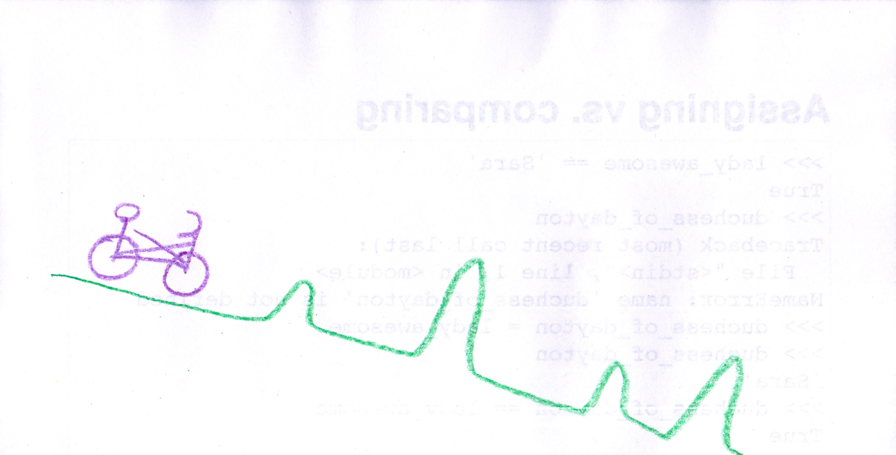

Python: Over the Bumps
----------------------

@catherinedevlin

PyOhio 2016

github.com/catherinedevlin/python-over-the-bumps

.. raw:: pdf

   PageBreak

The Vision
----------

.. raw:: pdf

   PageBreak

The Reality
-----------

.. raw:: pdf

   PageBreak

The Solution (?)
----------------

.. raw:: pdf

   PageBreak

2? 3?
-----

3

.. raw:: pdf

   PageBreak

Installation
------------

- python.org

- Anaconda

- PythonAnywhere.com

.. raw:: pdf

   PageBreak

Python environments
-------------------

- REPL: Improv comedy

- Double-click on a script (but don't)

- Run "script" from command line

- Special environments: Jupyter, IDLE, embedded in ESRI or game...

.. Difference between OS prompt and live Python prompt: python scales

.. it's not a single user-facing program

.. raw:: pdf

   PageBreak

"Variables"
-----------

Why do we have names?

Variable: a name for a piece of data

.. Very awkward when you don't know a name!

.. But we don't ask the names.  We tell them.

.. raw:: pdf

   PageBreak

"Assignment"
------------

It's like a knighting ceremony!

::

    >>> lady_buckeye = 'Sara'
    >>> lady_buckeye
    'Sara'

.. Dub them!  With the sword Equalibur!

.. raw:: pdf

   PageBreak

Assigning vs. comparing
-----------------------

::

    >>> lady_buckeye = 'Sara'
    >>> lady_buckeye == 'Sara'
    True
    >>> duchess_of_dayton
    Traceback (most recent call last):
      File "<stdin>", line 1, in <module>
    NameError: name 'duchess_of_dayton' is not defined
    >>> duchess_of_dayton = lady_buckeye
    >>> duchess_of_dayton
    'Sara'
    >>> duchess_of_dayton == lady_buckeye
    True

.. see-saw

.. raw:: pdf

   PageBreak

"Loop" variables
----------------

.. on Monday: get up, go to work, work, come home

::

    for runner in ['Sara', 'KC', 'Holly']:
        print('Go, ' + runner + ', go!')

    Go, Sara, go!
    Go, KC, go!
    Go, Holly, go!

.. are you still a runner after the race?

.. raw:: pdf

   PageBreak

Outlines
--------

::

    Ohio:
      Cities:
        Columbus
        Dayton
      Official Animals:
        Cardinal
        7-spot Ladybug
        Spotted Salamander
    Pennsylvania:
      Cities:
        Pittsburgh
        Erie
      Official Animals:
        Brook Trout
        Ruffed Grouse
        Pennsylvania Firefly

.. raw:: pdf

   PageBreak

Outline
-------

.. image:: outline.jpg
   :width: 80%

.. raw:: pdf

   PageBreak

Indenting
---------

::

    def letter_number_combos():
        for letter in ['a', 'b', 'c']:
            print('letter ' + letter)
            for number in [1, 2, 3]:
                print(letter + number)
        print('the end')
    print('here we go')
    letter_number_combos()

.. raw:: pdf

   PageBreak

Indenting
---------

.. raw:: pdf

   PageBreak

"Functions"
-----------

.. It's like a recipe.  For a robot.

::

    def taco_salad(chips, beans, cheese, salsa):
        salad = chips + ', ' \
            + beans + ', ' \
            + cheese + ', ' \
            + salsa
        return salad

    >>> taco_salad('blue corn chips', 'black beans',
    ...     'monterrey jack', 'mild salsa')

    'blue corn chips, black beans, monterrey jack, mild salsa'

.. raw:: latex

    \newpage

.. raw:: pdf

   PageBreak

With different data
-------------------

::

    def taco_salad(chips, beans, cheese, salsa):
        salad = chips + ', ' \
            + beans + ', ' \
            + cheese + ', ' \
            + salsa
        return salad

    >>> taco_salad('white corn chips', 'pinto beans',
    ...     'Velveeta', 'hot salsa')

    'white corn chips, pinto beans, Velveeta, hot salsa'

.. raw:: pdf

   PageBreak

Function "arguments"
--------------------

.. demo: re-labelling

::

    def taco_salad(chips, beans, cheese, salsa):
        salad = chips + ', ' \
            + beans + ', ' \
            + cheese + ', ' \
            + salsa
        return salad

    my_chips = 'blue corn chips'
    some_beans = 'black beans'
    good_cheese = 'Monterrey jack'
    the_salsa = 'mild salsa'

    taco_salad(my_chips, some_beans, good_cheese, the_salsa)

.. raw:: pdf

   PageBreak

Multiple choice: GREEN
----------------------

::

    flavor = 'moose tracks'
    top_with = 'caramel'

    def sundae(ice_cream, topping):
        return (ice_cream + ' + ' + topping)

    sundae(flavor, top_with)

.. raw:: pdf

   PageBreak

Multiple choice: BROWN
----------------------

::

    flavor = 'moose tracks'
    top_with = 'caramel'

    def sundae('moose tracks', 'caramel'):
        return (ice_cream + ' + ' + topping)

    sundae(flavor, top_with)

.. raw:: pdf

   PageBreak

Multiple choice: ORANGE
-----------------------

::

    flavor = 'moose tracks'
    top_with = 'caramel'

    def sundae(ice_cream, topping):
        return (ice_cream + ' + ' + topping)

    sundae(ice_cream, topping)

.. raw:: pdf

   PageBreak

Multiple choice: BLUE
---------------------

::

    flavor = 'moose tracks'
    top_with = 'caramel'

    def sundae(ice_cream, topping):
        return (ice_cream + ' + ' + topping)

    sundae('flavor', 'top_with')

.. raw:: pdf

   PageBreak

No arguments
------------

::

    def favorite():
        return 'chocolate chip'

    >>> favorite()
    'chocolate chip'

.. raw:: pdf

   PageBreak

Call with `()`
--------------

    >>> favorite
    <function favorite at 0x10b5010c8>

    >>> favorite()
    'chocolate chip'

.. need that grocery basket - even empty

.. otherwise, it's like the page number in the cookbook

.. raw:: pdf

   PageBreak

No return
---------

::

    def make_yourself_a_sandwich(bread, filling):
        sandwich = bread + filling + bread

    >>> make_yourself_a_sandwich('whole wheat', 'tuna salad')
    >>> sandwich
    Traceback (most recent call last):
      File "<stdin>", line 1, in <module>
    NameError: name 'sandwich' is not defined

.. raw:: pdf

   PageBreak

"Assign" the return
-------------------

::

    def make_me_a_sandwich(bread, filling):
        sandwich = bread + ', ' + filling + ', ' + bread
        return sandwich

    >>> my_sandwich = make_me_a_sandwich('whole wheat', 'tuna salad')
    >>> my_sandwich
    'whole wheat, tuna salad, whole wheat'

.. raw:: pdf

   PageBreak

"Modules"
---------

::

    name,species,kg,notes
    Alfred,wart hog,22,loves turnips
    Gertrude,polar bear,312.7,deep thinker
    Emily,salamander,0.3,

.. eggbeater vs fork

.. raw:: pdf

   PageBreak

Getting the eggbeater
---------------------

Store to kitchen: "`install`"

Kitchen to countertop: "`import`"

.. raw:: pdf

   PageBreak

Missing import
--------------

    >>> animal_data = csv.reader('animals.csv')
    Traceback (most recent call last):
      File "<stdin>", line 1, in <module>
    NameError: name 'csv' is not defined
    >>> import csv
    >>> animal_data = csv.reader('animals.csv')

`csv` is not on the countertop

.. raw:: pdf

   PageBreak

Missing install
---------------

::

    >>> pandas.read_csv('animals.csv')
    Traceback (most recent call last):
      File "<stdin>", line 1, in <module>
    NameError: name 'pandas' is not defined
    >>> import pandas
    Traceback (most recent call last):
      File "<stdin>", line 1, in <module>
    ImportError: No module named pandas

.. raw:: pdf

   PageBreak

Going to the store
------------------

::

    $ pip install pandas
    Collecting pandas
    ...
    $ python
    >>> import pandas
    >>> animal_data = pandas.read_csv('animals.csv')

.. raw:: pdf

   PageBreak

Huh?
----

::

    pip install pandas

`pip`
  Pip Installs Packages

`pandas`
  Name of package

`PyPI`_
  the "store"

.. _`PyPI`: https://pypi.python.org/pypi

.. raw:: pdf

   PageBreak

Advice
------

- `Hitchhikers’ Guide`_ to Python
- help@python.org, reddit
- websearch for blogs
- User community

.. raw:: pdf

   PageBreak

"virtualenv"
------------

image: Joergelman @ pixabay

.. raw:: pdf

   PageBreak

pyvenv: a kitchen-builder
-------------------------

::

    $ pyvenv ~/virtualenvs/pyohio
    $ . ~/virtualenvs/pyohio/bin/activate
    $ pip install requests
    $ python
    >>> import requests
    >>> exit()
    $ rm -rf . ~/virtualenvs/pyohio/bin/activate

.. raw:: pdf

   PageBreak

Git
---

-  Version control tool
-  Install ``git``
-  What’s a “repo”?
-  `GitHub`_
-  ``git clone <repo URL>``
-  `GitKraken`_

.. raw:: pdf

   PageBreak

Projects
--------

-  `Arcade game`_

-  `Office automation`_

-  `Web scraping`_

-  `Web application`_

-  `Raspberry Pi`_

-  `Analytic math: SAGE`_

-  `Numeric math: Pandas`_

-  `Text analysis`_

-  `Phone programming`_

- `Bots`_!

.. raw:: pdf

   PageBreak

Getting help and getting connected
----------------------------------

-  `Beginners’ Guide`_

-  `Hitchhikers’ Guide`_

-  Community!

  -  help@python.org
  -  `tutor list`_
  -  PyOhio
  -  Python User Groups

.. raw:: pdf

   PageBreak

Full-scale tutorials
--------------------

- `Udemy course <https://www.udemy.com/automate/?couponCode=50_PERCENT_OFF>`_
- `CodeAcademy <https://www.codecademy.com/>`_
- `Invent with Python books <https://inventwithpython.com/>`_
- http://learnpython.org/

Do not fear!
------------

@catherinedevlin

PyOhio 2016

github.com/catherinedevlin/python-over-the-bumps

.. _Hitchhikers’ Guide: http://docs.python-guide.org/en/latest/
.. _GitHub: https://github.com/catherinedevlin/python-over-the-bumps
.. _GitKraken: https://www.gitkraken.com/
.. _Arcade game: http://pythonhosted.org/arcade/
.. _Office automation: https://automatetheboringstuff.com/
.. _Web scraping: https://automatetheboringstuff.com/
.. _Web application: https://djangogirls.org/
.. _Raspberry Pi: https://www.raspberrypi.org/blog/learning-python-with-raspberry-pi/
.. _`Analytic math: SAGE`: http://www.sagemath.org/
.. _`Numeric math: Pandas`: http://pandas.pydata.org/
.. _Text analysis: http://www.nltk.org/book/
.. _Phone programming: https://kivy.org/
.. _Beginners’ Guide: https://wiki.python.org/moin/BeginnersGuide
.. _tutor list: https://mail.python.org/mailman/listinfo/tutor
.. _Bots: https://www.youtube.com/watch?v=iU9FM9qnEjk
